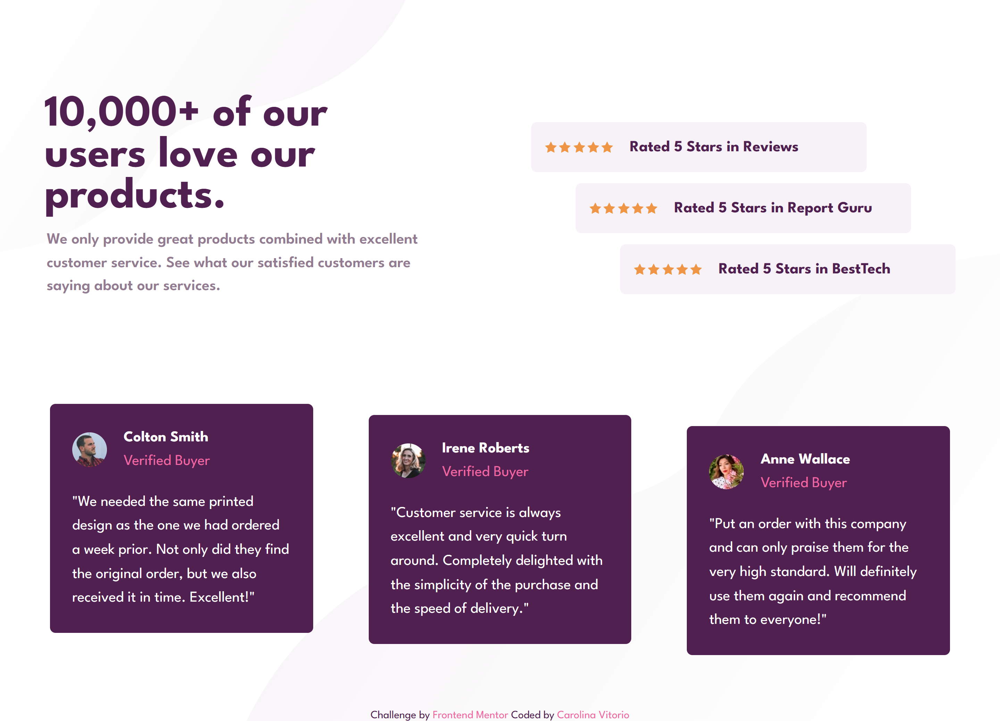
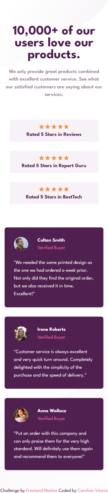

# 💬 Social Proof Section

Página de seção de prova social responsiva desenvolvida como desafio do [Frontend Mentor](https://www.frontendmentor.io/).  
O objetivo é replicar o layout proposto, aplicando boas práticas de **HTML** e **CSS**, com foco em **responsividade** e **estilo moderno**.

---

## 📌 Sobre o Projeto

Este projeto foi construído como parte do desafio [Social proof section challenge on Frontend Mentor](https://www.frontendmentor.io/challenges/social-proof-section-6e0qTv_bA), com o intuito de praticar estruturação semântica, responsividade e estilização de componentes simples.

---

## 🚀 Funcionalidades

-  🔹 Layout 100% responsivo (mobile-first)
-  🔹 Estilo moderno com cores acessíveis
-  🔹 Estrutura limpa e reutilizável

---

## 🛠 Tecnologias Utilizadas

  
  

---

## 📷 Imagens do Projeto

### 🖥️ Versão Desktop (1440px)

  

---

### 📱 Versão Mobile (375px)

  

---

## 🔗 Acesse o Projeto

- 🔗 [Visualizar Online (GitHub Pages)](https://carolinavitorio.github.io/SocialProofSection/)
- 📂 [Repositório no GitHub](https://github.com/carolinavitorio/SocialProofSection.git)

---

## 👩‍💻 Desenvolvido por

[Carolina Vitorio](https://github.com/carolinavitorio) 💙
